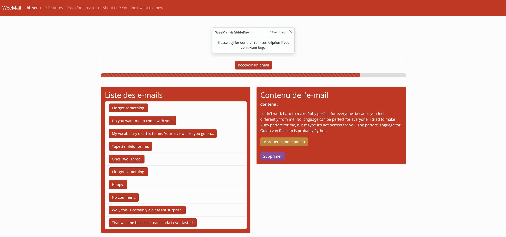

# WeeMail

WeeMail est une application web simple permettant de gérer une liste d'e-mails avec des fonctionnalités basiques. Ce projet a été développé dans le cadre d'un atelier pratique pour apprendre à utiliser Turbo Streams et Hotwire sur Ruby on Rails.

## Fonctionnalités

- Affichage de la liste des e-mails.
- Ajout d'un nouvel e-mail avec un bouton.
- Affichage détaillé d'un e-mail sélectionné en temps réel depuis la page d'acceuil.
- Marquage d'un e-mail comme lu/non lu avec mise à jour en temps réel (Ah oui oui oui! Et avec la voix de Julien Lepers s'il vous plait!).
- Suppression d'un e-mail avec mise à jour en temps réel de la liste (euh, presque).

## Aperçu du rendu final

## Technologies utilisées

- Ruby on Rails
- Turbo Streams
- Bootstrap

## Instructions d'utilisation

1. Cloner le projet depuis le repository.
2. Installer les dépendances avec la commande `bundle install`.
3. Créer la base de données avec `rails db:create` et `rails db:migrate`.
4. Lancer le serveur avec `rails server`.
5. Accéder à l'application dans le navigateur à l'adresse `http://localhost:3000`.

## Licence

(╯°□°）╯